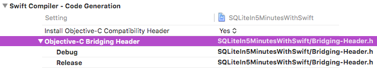
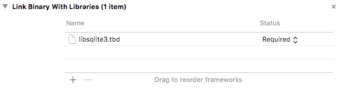

# 004.65.sql-sqlite-in-5-minutes

Based on ["SQLite in 5 minutes or less"](https://sqlite.org/quickstart.html) at [sqlite.org](https://sqlite.org/).  This implementation is for Swift 2.2.

Updated for Swift 4 and Xcode 9

## Xcode Project Setup

1. **New Swift Project.** Xcode > File > New > Project… > OS X Command Line Tool
2. **Add Bridging Header.**

    ~~~c
    #ifndef Bridging_Header_h
    #define Bridging_Header_h

    #import "sqlite3.h"
    #import <time.h>

    #endif /* Bridging_Header_h */
    ~~~

    

3. **Link Libraries.** Project Settings > TARGETS > Build Phases > Link Binary With Libraries `+`. Search on sqlite.

    

## Code

Each file contains a varied approach for accessing an SQLite database using Swift.

• `main.swift` - exercises all of the approaches.  
• `CallbackBasic.swift` - closest to sqlite.org example. _C style._  
• `ClosureBasic.swift` - replaces `callback` function with literal closure. _C style._  
• `ClosureResults.swift` - return `Array` of gathered row `Dictionaries`. _Swift style._  
• `Command.swift` - execute an SQL statement which does not return any row data.  
• `Details.swift` - example with prepare, step, column, and finalize.  
• `SqlQuery.swift` - example `class` with prepare, bind, step, column, and finalize.  

**`main.swift`** Provides `typealias` used by each example.

~~~swift
typealias sqlite3 = OpaquePointer // :SWIFT2: COpaquePointer
typealias CCharHandle = UnsafeMutablePointer<UnsafeMutablePointer<CChar>>
typealias CCharPointer = UnsafeMutablePointer<CChar>
typealias CVoidPointer = UnsafeMutablePointer<Void>
~~~

*Note: The Swift `callback` can be either a global, non-instance procedure `func` or a non-capturing literal closure `{}`.*

**`CallbackBasic.swift` C Style Callback**  

~~~swift
func callback(
    resultVoidPointer: CVoidPointer, // void *NotUsed 
    columnCount: CInt,               // int argc
    values: CCharHandle,             // char **argv     
    columns: CCharHandle             // char **azColName
    ) -> CInt {
    for  i in 0 ..< Int(columnCount) {
        guard let value = String.fromCString(values[i]) else {
            print("No value")
            continue
        }
        guard let column = String.fromCString(columns[i]) else {
            print("No column")
            continue
        }
        print("\(column) = \(value)")
    }
    return 0 // 0 == status ok
}

func sqlQueryCallbackBasic(argc: Int, argv: [String]) -> Int {
    var db: sqlite3 = nil 
    var zErrMsg:CCharPointer = nil
    var rc: Int32 = 0 // result code
    
    if argc != 3 {
        print(String(format: "ERROR: Usage: %s DATABASE SQL-STATEMENT", argv[0]))
        return 1
    }
    
    rc = sqlite3_open(argv[1], &db)
    if  rc != 0 {
        print("ERROR: sqlite3_open " + String.fromCString(sqlite3_errmsg(db))! ?? "" )
        sqlite3_close(db)
        return 1
    }
    
    rc = sqlite3_exec(db, argv[2], callback, nil, &zErrMsg)
    if rc != SQLITE_OK {
        print("ERROR: sqlite3_exec " + String.fromCString(zErrMsg)! ?? "")
        sqlite3_free(zErrMsg)
    }
    
    sqlite3_close(db)
    return 0
}
~~~

**`ClosureBasic.swift` Swift Closure. C Style.**  

~~~swift
func sqlQueryClosureBasic(argc argc: Int, argv: [String]) -> Int {
    var db: sqlite3 = nil 
    var zErrMsg:CCharPointer = nil
    var rc: Int32 = 0
    
    if argc != 3 {
        print(String(format: "ERROR: Usage: %s DATABASE SQL-STATEMENT", argv[0]))
        return 1
    }
    
    rc = sqlite3_open(argv[1], &db)
    if  rc != 0 {
        print("ERROR: sqlite3_open " + String.fromCString(sqlite3_errmsg(db))! ?? "" )
        sqlite3_close(db)
        return 1
    }
    
    rc = sqlite3_exec(
        db,      // database 
        argv[2], // statement
        {        // callback: non-capturing closure
            resultVoidPointer, columnCount, values, columns in
            
            for i in 0 ..< Int(columnCount) {
                guard let value = String.fromCString(values[i]) else {
                    print("No value")
                    continue
                }
                
                guard let column = String.fromCString(columns[i]) else {
                    print("No column")
                    continue
                }
                print("\(column) = \(value)")
            }
            return 0
        }, 
        nil, 
        &zErrMsg
    )
    
    if rc != SQLITE_OK {
        let errorMsg = String.fromCString(zErrMsg)! ?? ""
        print("ERROR: sqlite3_exec \(errorMsg)")
        sqlite3_free(zErrMsg)
    }
    
    sqlite3_close(db)
    return 0
}
~~~

**`closureResults.swift` Swift Closure. Returns Array\<Dictionary\>.**  

~~~swift
class Result {
    class Row {
        var data: [String: String]
        init() { self.data = [:] }
    }
    
    var rows: [Row]
    init() { self.rows = [] }
}

func sqlQueryClosureWithResults(path path: String, sql: String) -> [Result.Row] {
    var db: sqlite3 = nil 
    var errorMessage: CCharPointer = nil
    var resultcode: Int32 = 0
        
    resultcode = sqlite3_open(path, &db)
    if  resultcode != 0 {
        print("ERROR: sqlite3_open " + String.fromCString(sqlite3_errmsg(db))! ?? "" )
        sqlite3_close(db)
        return []
    }
        
    let resultPointer = UnsafeMutablePointer<Result>.alloc(1)
    var result = Result()
    resultPointer.initializeFrom(&result, count: 1)
    
    resultcode = sqlite3_exec(
        db,  // database 
        sql, // statement
        {    // callback: non-capturing closure
            resultVoidPointer, columnCount, values, columns in
            let resultPointer = UnsafeMutablePointer<Result>(resultVoidPointer)
            let result = resultPointer.memory
            
            let row = Result.Row()
            for i in 0 ..< Int(columnCount) {
                guard let value = String.fromCString(values[i]) else {
                    print("No value")
                    continue
                }
                
                guard let column = String.fromCString(columns[i]) else {
                    print("No column")
                    continue
                }
                
                row.data[column] = value
            }
            
            result.rows.append(row)
            return 0
        }, 
        resultPointer, // 
        &errorMessage
    )
    
    if resultcode != SQLITE_OK {
        let errorMsg = String.fromCString(errorMessage)! ?? ""
        print("ERROR: sqlite3_exec \(errorMsg)")
        sqlite3_free(errorMessage)
    }
    
    sqlite3_close(db)
    return result.rows
}
~~~

May your "5-minutes" be less than the "5-minutes" needed to prepare this project. Cheers. :-)
